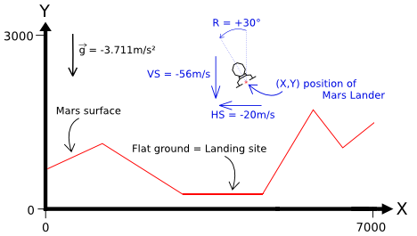

# MarsLander
 A Codingame puzzle 

# [Mars Lander Episode-1](https://www.codingame.com/ide/puzzle/mars-lander-episode-1)

My Ynote: "Coding Games - Mars Lander" 
[Study "Genetic Algorithm Implementation in Python" with helps of peforth](https://github.com/hcchengithub/GeneticAlgorithmPython/blob/master/Genetic%20Algorithm%20Implementation%20in%20Python.ipynb)

I didn't understand this game at first and that's a big concern to invest my time into developing the program. Thanks to [McKelian](https://www.codingame.com/forum/t/mars-the-game/756) and his [video game](http://www.mckelian.com/index.php/mars/choix) that mimics the Mars Lander puzzle.

### Goal 
- land on flat ground
- land in a vertical position (tilt angle = 0°)
- vertical speed must be limited ( ≤ 40m/s in absolute value)
- horizontal speed must be limited ( ≤ 20m/s in absolute value)

這套公式成功了。

Initialize

    thrust = 4    # the thrust command 
    rotate = 0    # the rotate command 
    a0 = 0        # absolute angle of the ship 
    pwr0 = 0      # 引擎出力
    gravity = 3.711  # constant on Mars
    p0 = v(2500, 2700)  # Initial position
    s0 = v(0,0)     # Initial speed vector
    g = angle2uv(-180) * gravity  # 重力向量
    step = 0
    
Run

    # f = m.a  因為 m 不變故當成 1 所以 f = a 也就是 force = g 
    # Duration t = 1 一步的時間都是 1 所以移動距離 s0 + (1/2)(force)(t^2) 變成 s0 + (1/2)*(force)
    
    step += 1

    a1 = angle15(a0,rotate)  # 這一步的角度，最多 15 degree 故名之。
    pwr1 = thrust_1(pwr0,thrust)  # 這一步的 引擎推力
    force = g + angle2uv(a1) * pwr1   # force on the ship during this step 
    s1 = s0 + force  # 這一步將達到的速度 s0 + (delta time)(acceleration) 
                     # where delta time is 1, a is force as mentioned above.
    p1 = p0 + s0 + (1/2)*(force)  # where "s0 + (1/2)*(force)" is position delta 這一步將到達的位置

    %f step -->
    %f a0 pwr0 -2 slice -->  # 上一步的 角度 與 引擎出力 0 1 2 3 4
    %f a1 pwr1 -2 slice -->  # 作用在這一步上的 角度 與 引擎出力
    %f force dup -->
    %f ===>      # 重力 與 引擎出力 的合力向量
    %f s1 ===>   # 這一步最後的速度
    %f p1 ===>   # 這一步最後的位置

    a0 = a1
    pwr0 = pwr1
    s0 = s1
    p0 = p1